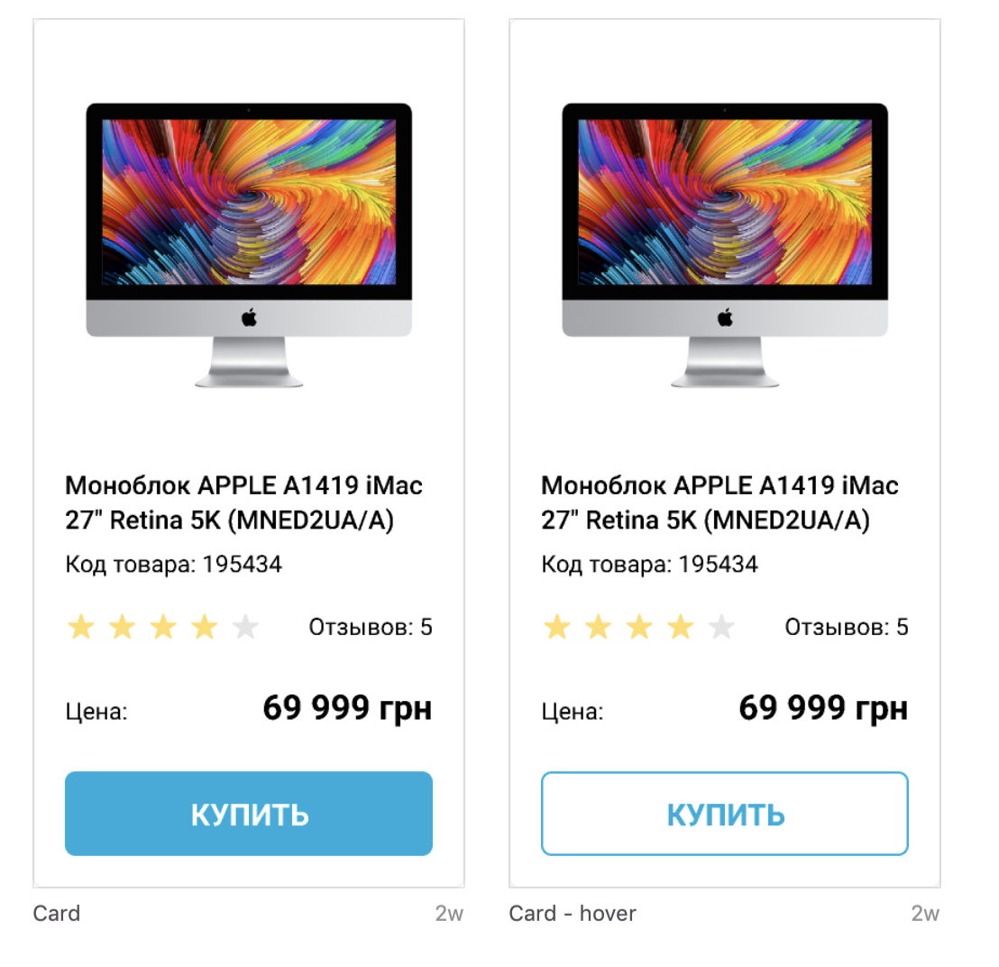

Create a pages with product card using `flexbox` basing on [the mockup](https://www.figma.com/file/euXjY316CHKYkPRO1K0kjLsF/Moyo-Catalog?node-id=11325%3A2288).

# Requirements:
- reset browser's default margins
- card width is `200px` including border
- use images from [src/images](src/images)
- change link styles on `:hover`
- follow styles from the mock
- add `data-qa="card"` attribute to the card block
- add `data-qa="hover"` attribute to the link

## Tips & Hints
- Add **ALL** `data-qa` attributes required in the task
- Reuse `stars` block from [Stars task](https://github.com/fesfa-friends/stars-task)
and keep it operational. If you change `stars--4` modifier to `stars--2` or
other - number of selected stars should change correctly.
- Item with text 'Купить' should be a link.
- Check font styles on the mockup. Use [google fonts](https://fonts.google.com/)

---
